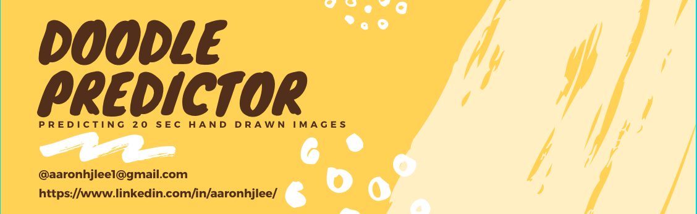
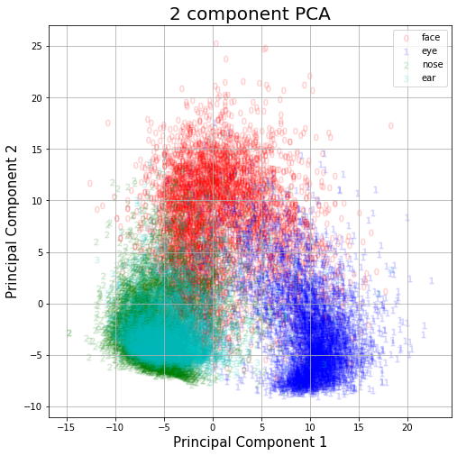

# DoodlePredictor
**Predicting what category an image belongs to based on Google "Quick, Draw"**
 Aaron Lee
 
[Linkedin](http://www.linkedin.com/in/aaronhjlee) | [Github](https://github.com/aaronhjlee)

## Table of Contents

* [Motivation](#motivation)
  * [Personal](#personal)
  * [Question](#question)
* [Strategy](#strategy)
* [Exploratory Data Analysis](#exploratory-data-analysis)
  * [Pipeline](#pipeline-source)
* [Principal Component Analysis](principal-component-analysis-(pca))
* [Machine Learning Modeling](machine-learning-models)
* [Conclusion](#conclusion)
* [Future Analysis](#future-analysis)
* [Tools Used](#tools-used)
* [References](#references)
* [Contact](#contact-information)

## Motivation

### Personal

I have always been interested in how machines identify images and the models that underlie the technology as a whole. If a machine is able to identify key elements in an images, maybe that might lend itself to complete more complex tasks: image sorting, labeling, composition construction, self-driving cars, etc. The possibilities are endless. 

### Question

With many complex technologies in the world today, there is always a simple starting point. Before we can start to have machines sort and label things in real life, we have to start with the basics; classifying 2D images of black and white drawings. 
Can we build a model to distinguish hand drawn human facial features? We will begin with the general shape of a face and then move to add more features such as: eyes, ears, mouths, nose, and a beard.

## Strategy

#### 1. Load and Clean Data
#### 2. Exploratory Data Analysis
* Transform with Principal Component Analysis
* Find Ideal Varience Percentage / Number of Components
#### 3. Compare Machine-Learning Models
* [Logistic Regression Classifier](https://scikit-learn.org/stable/modules/generated/sklearn.linear_model.LogisticRegression.html)
* [Decision Tree Classifier](https://scikit-learn.org/stable/modules/generated/sklearn.tree.DecisionTreeClassifier.html)
* [Random Forest Classifier](https://scikit-learn.org/stable/modules/generated/sklearn.ensemble.RandomForestClassifier.html)
* [Gradient Boosting Classifier](https://scikit-learn.org/stable/modules/generated/sklearn.ensemble.GradientBoostingRegressor.html)
* [Support Vector Machine Classifier](https://scikit-learn.org/stable/modules/svm.html)
#### 4. Optimization 
* Use Grid Search to find the best hyper-parameters

## Exploratory Data Analysis

### Pipeline (Source)

<!--  -->

### Data Overview
  1. Dataset: 100000+ label .npy and ndjson files per facial feature from [Quick-Draw](https://quickdraw.withgoogle.com/)
  2. 4 total facial features: face, eyes, nose, and ears
  3. 183 unique countries out of 196 countries (UN considers 241 countries-fun fact!)
  4. Each drawing contained information about the number of strokes, location, timestamp, recognition(binary), and label
  5. Sample 5000 images randomly from each facial feature category for a grand total of 20,000 images in our available dataset
  6. Google's [Neural Network](https://adventuresinmachinelearning.com/python-tensorflow-tutorial/) was able to achieve a recognition rate of over *91%* across 345 different categories of doodles
  7. Drawing Examples
Below are drawings that Google's NN recognized and followed by drawings that were not. 

True faces: \
 
 
False faces: \
 

True eyes: \
  
 
False eyes: \
 

True noses: \
 
 
False noses: \
 

True ears: \
 

False ear: \
 

For the purposes of training and testing our model, we will be using only images that were **corrected identified** by Google's model to avoid unnecessary errors in our model. 

## Principal Component Analysis (PCA)

Before we start any sort of modeling, we have to manage the number of features we are dealing with. Since each image is 28 x 28 [pixels](https://en.wikipedia.org/wiki/Pixel), this gives us a total of 784 pixel image which equates to 784 features for our models to account for. That's way too many! Therefore we must apply [principal component analysis](https://en.wikipedia.org/wiki/Principal_component_analysis) (orthoganal transformations) in order to convert a set of correlated observations into linearly uncorrelated variables called *principal components*. 

### 2D PCA Plot

We start this process by applying a [standard scaler](https://scikit-learn.org/stable/modules/generated/sklearn.preprocessing.StandardScaler.html) to transoform the values that make up our images followed by PCA of 2 principal components. 

 

We can see that there is a clear distinction between the face and the eyes, however, there seems to be an overlap of the nose and ears. I wonder what we can do about this...

### 3D PCA Plot

We can continue to explore the different clusters by bringing this into 3 dimensions!

 

### More Dimensions and its Effects

Generally speaking, the more dimensions we add (more principal components) to the our models, the more accurate the results. Let's see how many components we need to achieve a high [varience percentage](https://www.myaccountingcourse.com/accounting-dictionary/percent-variance); the higher the percentage the better our prediction. 

 

As we can see, the more PC's we add, the higher the varience percentage we get. To put this into perspective, the number of components we add, the more distinct our lines become, making it easier for our machine-learning models to comprehend and sort.

## Machine Learning Models

## Future Analysis

* Include more categories for our model to recognize
* Using a Convolutional Neural Network to predict
* Building a model in the cloud (AWS-EC2) so it can continually add new inputs over time
* Branch out to real images to classify

## Tools Used

* [Python](https://www.python.org/)
* [Pandas](https://pandas.pydata.org/)
* [Numpy](http://www.numpy.org/)
* [SciPy](https://www.scipy.org/)
* [Matplotlib](https://matplotlib.org/)
* [Seaborn](https://seaborn.pydata.org/)
* [Scikit-Learn](https://scikit-learn.org/stable/)
* [ndJson](http://ndjson.org/)

## References

* https://github.com/Jasminehh/doodle_image_recognition_CNN
* https://github.com/googlecreativelab/quickdraw-dataset#the-raw-moderated-dataset

## Contact Information
Aaron Lee is a Data Scientist with a background in education and portrait/landscape photography. His interests other than data science include music, photography, backpacking, basketball, and running. 

* Linkedin: [in/aaronhjlee](https://www.linkedin.com/in/aaronhjlee/)
* Github: [/aaronhjlee](https://github.com/Aaronhjlee)
* Email: [@aaronhjlee1@gmail.com](aaronhjlee1@gmail.com)

Copyright © 2019 Aaron Lee